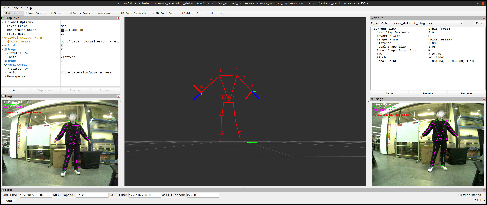

# ROBOSENSE SKELETON DETECTION

[English Version](README.md)

一个用于人体骨架检测的 ROS/ROS2 项目，基于 ROBOSENSE AC2 传感器的点云和图像进行处理，使用 TensorRT 进行加速。该项目同时支持 **ROS1** 和 **ROS2**，可以实时地从 AC2 数据中提取人体骨架信息，并发布相关的 ROS/ROS2 消息。

## 系统要求

- Ubuntu (20.04/22.04/24.04)
- ROS2 (Foxy/Humble/Jazzy)
- CUDA 12.x
- TensorRT 10.x
- C++17

## 依赖项

在编译本项目之前，请确保系统中已安装必要的开发库，并正确配置了驱动环境。

### 1. 系统库安装

本项目依赖 `spdlog` 日志库，请执行以下命令安装：

```bash
sudo apt install libspdlog-dev
```

### 2. 驱动节点配置

需要 [robosense_ac_driver](https://github.com/RoboSense-Robotics/robosense_ac_driver) 节点发布 AC2 传感器数据，如果尚未编译，请先下载该驱动源码并编译。

```bash
git clone git@github.com:RoboSense-Robotics/robosense_ac_driver.git
cd robosense_ac_driver
colcon build
source install/setup.bash
```

## 安装步骤

### 1. 克隆代码

```bash
git clone git@github.com:RoboSense-Robotics/robosense_skeleton_detection.git
cd robosense_skeleton_detection
```

### 2. 模型转换

项目使用 TensorRT 进行推理加速，需要将 ONNX 模型转换为 TRT 模型。

在下载模型前，请先创建所需目录：

```bash
mkdir -p src/rs_motion_capture/model/onnx
mkdir -p src/rs_motion_capture/model/x86_64
```

#### 2.1 下载 ONNX 模型

本仓库中不包含模型文件，请先下载：
- [dynamic_rtmdet_s_coco_640x640_20231209.onnx](https://cdn.robosense.cn/models/skeleton_detection/dynamic_rtmdet_s_coco_640x640_20231209.onnx)
- [dynamic_end2end2_key26.onnx](https://cdn.robosense.cn/models/skeleton_detection/dynamic_end2end2_key26.onnx)

下载完成后，将文件放置到 `src/rs_motion_capture/model/onnx/`

目录结构应如下：
```
src/rs_motion_capture/model/onnx/
├── dynamic_rtmdet_s_coco_640x640_20231209.onnx  # 目标检测模型 (Stage 1)
└── dynamic_end2end2_key26.onnx                  # 姿态估计模型 (Stage 2)
```

#### 2.2 使用 TensorRT 转换模型

**下载 TensorRT 压缩包（可选）**

如果你还没有安装 TensorRT 可以尝试使用本仓库提供的压缩包，包含了 trtexec 工具用于模型转换以及相关的库文件。本仓库提供的 TensorRT 为免安装版本，解压后即可使用 trtexec 进行模型转换。

👉 下载地址  
[TensorRT-10.8.0.43.Linux.x86_64-gnu.cuda-12.8.tar.gz](https://cdn.robosense.cn/third_party/TensorRT-10.8.0.43.Linux.x86_64-gnu.cuda-12.8.tar.gz)

下载完成后，将压缩包解压到任意目录，

```bash
tar -xvf TensorRT-10.8.0.43.Linux.x86_64-gnu.cuda-12.8.tar.gz
```

**使用 trtexec 命令行工具**

```bash
# 确保 TensorRT 已正确安装并设置环境变量
export TENSORRT_DIR=<Your TensorRT Root Directory>
export PATH=$TENSORRT_DIR/bin:$PATH
export LD_LIBRARY_PATH=$TENSORRT_DIR/lib:$LD_LIBRARY_PATH

# 转换 Stage1 模型 (目标检测)
trtexec --onnx=src/rs_motion_capture/model/onnx/dynamic_rtmdet_s_coco_640x640_20231209.onnx --saveEngine=src/rs_motion_capture/model/x86_64/stage1.trt --fp16 --workspace=4096

# 转换 Stage2 模型 (姿态估计)
trtexec --onnx=src/rs_motion_capture/model/onnx/dynamic_end2end2_key26.onnx --saveEngine=src/rs_motion_capture/model/x86_64/stage2.trt --fp16 --workspace=4096
```

#### 2.3 模型对应关系

| ONNX 模型 | TRT 模型 | 用途 |
|-----------|---------|------|
| `dynamic_rtmdet_s_coco_640x640_20231209.onnx` | `stage1.trt` | 目标检测 (人体检测) |
| `dynamic_end2end2_key26.onnx` | `stage2.trt` | 姿态估计 (骨架关键点检测) |

**注意事项**
- TRT 模型需要根据你的 GPU 架构生成，不同架构的 GPU 生成的模型不通用
- x86_64 平台的模型存放在 `src/rs_motion_capture/model/x86_64/` 目录
- ARM 平台 (如 Jetson) 的模型存放在 `src/rs_motion_capture/model/aarch/` 目录
- 建议使用 `--fp16` 选项以获得更好的性能
- 如果转换失败,请检查 TensorRT 版本与 ONNX 模型的兼容性

### 3. 编译

**ROS2 (colcon):**
```bash
colcon build --cmake-args -DTENSORRT_RELEASE_PATH=<Your TensorRT Root Directory>
```

**ROS1 (catkin):**
```bash
catkin_make -DTENSORRT_RELEASE_PATH=<Your TensorRT Root Directory>
```

**说明**
- `<Your TensorRT Root Directory>` 是你本地 TensorRT 的安装路径，例如 `/media/sti/DD2/TensorRT-10.8.0.43`
- 编译前请确保已经完成模型转换步骤

### 4. 配置文件修改

配置文件位于 `src/rs_motion_capture/config/config.yaml` 应根据实际情况修改以下参数:

- `sensor.calib_path`: AC2 标定文件路径

## 运行

> ⚠️ **注意事项**
> 1. **驱动依赖**：在运行之前，请确保先启动了 `robosense_ac_driver` 节点发布 AC2 传感器数据。
> 2. **环境依赖 (TensorRT)**：本节点依赖 TensorRT 进行推理。运行前请确保已正确设置 TensorRT 根目录及环境变量，否则程序将无法加载必要的动态库。
> 3. **通信检查**：请确保当前终端与驱动节点处于相同的 `ROS_DOMAIN_ID`。

### 1. 配置环境变量

在运行节点前，请执行以下命令（建议根据您的实际路径修改 `<Your TensorRT Root Directory>`）：

```bash
export TENSORRT_DIR=<Your TensorRT Root Directory>
export PATH=$TENSORRT_DIR/bin:$PATH
export LD_LIBRARY_PATH=$TENSORRT_DIR/lib:$LD_LIBRARY_PATH
```

### 2. 启动节点

**ROS2:**
```bash
source install/setup.bash
ros2 launch rs_motion_capture motion_capture_node_launch.py collector:=zed calib_mode:=false
```

**ROS1:**
```bash
source devel/setup.bash
roslaunch rs_motion_capture motion_capture_node_ros1.launch collector:=zed calib_mode:=false
```

## ROS 话题

### 订阅话题

- `/rs_camera/left/color/image_raw` - 左相机 RGB 图像
- `/rs_camera/right/color/image_raw` - 右相机 RGB 图像
- `/rs_lidar/points` - 激光雷达点云

### 发布话题

- `/pose_detection/pose_markers` - 3D 骨架姿态
- `/left/pd` - 2D 骨架姿态（左相机图像）
- `/right/pd` - 2D 骨架姿态（右相机图像）

## 可视化

通过 ros2 launch 运行本项目，将自启动 RViz2 进行可视化，可以在 RViz2 中查看:
- 人体骨架关键点
- 3D 姿态估计结果
- 点云数据
- 相机图像



## 常见问题

### 1. 编译时找不到 TensorRT

确保正确设置 `TENSORRT_RELEASE_PATH` 参数，并且 TensorRT 已正确安装。

```bash
# 检查 TensorRT 安装
ls <Your TensorRT Root Directory>/lib
# 应该能看到 libnvinfer.so 等库文件
```

### 2. 运行时提示找不到 TRT 模型文件

请确保已经完成模型转换步骤，并且 TRT 模型文件位于正确的目录:
- x86_64: `src/rs_motion_capture/model/x86_64/stage1.trt` 和 `stage2.trt`
- ARM: `src/rs_motion_capture/model/aarch/stage1.trt` 和 `stage2.trt`

### 3. 模型推理速度慢

- 确保使用了 `--fp16` 选项进行模型转换
- 检查 GPU 驱动是否正确安装
- 适当增加 `--workspace` 大小 (建议 4096MB 或更高)
